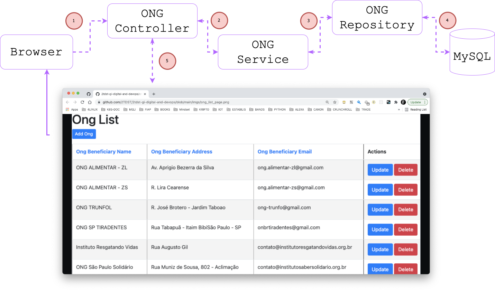

---


---
#### SQUAD: SLASHICORP
#### STUDENTS:

- [RM85619 - Allan Phyllyp Reis](https://www.linkedin.com/in/allan-reis-997b82171/)
- [RM84082 - Dihogo Cassimiro Teixeira](https://www.linkedin.com/in/dihogoteixeira/)
- [RM85833 - Fernando Borgatto Bouman](https://www.linkedin.com/in/fernando-borgatto-bouman-821534b9/)
- [RM86486 - Paloma Rangel Rocha](https://www.linkedin.com/in/palomara/)
- [RM85468 - Juan Carlos Benvive Serrano](https://www.linkedin.com/in/juan-carlos-benvive-serrano-529615195/)
---
#### SUBJECTS:
- DIGITAL BUSINESS ENABLEMENT 
- DEVOPS TOOLS AND CLOUD COMPUTING
---
#### TECHNOLOGIES:
- Spring Boot
- JPA
- Hibernate
- [Java JDK (v8+)](https://www.oracle.com/technetwork/java/javase/downloads/index.html)
- [Maven (v3+)](https://maven.apache.org/download.cgi)
- MySQL
- Thymeleaf
---
#### APPLICATION PURPOSE:
<ul>
    The purpose of this application is to provide an API with Brazilian ONGs data by type of segment,
    providing the user with next versions, Brazilian ONGs data by region and contact information. 
    This API should provide serialized data from raw tables of registration information 
    for regulated Brazilian ONGs so that you can work with their data.
</ul>

#### THE DIAGRAM SHOWS THE APPLICATION FLOW OF OUR SPRING MVC WEB APPLICATION WITH THYMELEAF:



---
#### REQUIREMENTS INSTALLATION PER DISTRO
- [Install Docker Engine on CentOS](https://docs.docker.com/engine/install/centos/)
- [Install Docker Engine on Debian](https://docs.docker.com/engine/install/debian/)
- [Install Docker Engine on Fedora](https://docs.docker.com/engine/install/fedora/)
- [Install Docker Engine on Ubuntu](https://docs.docker.com/engine/install/ubuntu/)
- [Install Docker Desktop on Mac](https://docs.docker.com/desktop/mac/install/)
- [Install Docker Desktop on Windows](https://docs.docker.com/desktop/windows/install/)
---
#### RUNNING ON LOCAL DOCKER ENV

Before you beginning, let's clone the project:

```bash
git clone https://github.com/2TDST/2tdst-gi-digital-and-devops.git
cd 2tdst-gi-digital-and-devops
```

Now, in this same local path `src/main/resources/` open that **application.properties** file resources config,
comment the session:

```yaml 
spring.datasource.url=jdbc:$CLEARDB_DATABASE_URL
```

and then, remove comment of all these settings, in the same file

```yaml
spring.datasource.url=jdbc:mysql://localhost:3306/gi_ods_db?useSSL=false&serverTimezone=UTC&useLegacyDatetimeCode=false
spring.datasource.username=root
spring.datasource.password=root
```

#### EXECUTING APP WITH DOCKER-COMPOSE

```bash
docker-compose up -d
```

#### CHECK ENV APPLICATION
```bash
$ docker ps
---
CONTAINER ID   IMAGE                    COMMAND                  CREATED         STATUS         PORTS                                                  NAMES
ffd96ae4345d   springboot-dbe-ods_web   "java -jar /app.jar"     7 seconds ago   Up 6 seconds   0.0.0.0:8080->8080/tcp, :::8080->8080/tcp              springboot-dbe-ods_web_1
d85dec1876d8   springboot-dbe-ods_db    "docker-entrypoint.s…"   7 seconds ago   Up 6 seconds   0.0.0.0:3306->3306/tcp, :::3306->3306/tcp, 33060/tcp   springboot-dbe-ods_db_1
---
```

#### OPEN APP ON LOCALHOST

Click [here](http://localhost:8080/) to check UI **Thymeleaf**, on your docker local env.

`Ong List Page`


`Add New Ong Page`


`Update Ong Page`


---
#### OPEN APP ON HEROKU CLOUD APP

Click [here](https://fiap-ongs.herokuapp.com/) to check UI **Thymeleaf**, on Heroku Cloud App.
