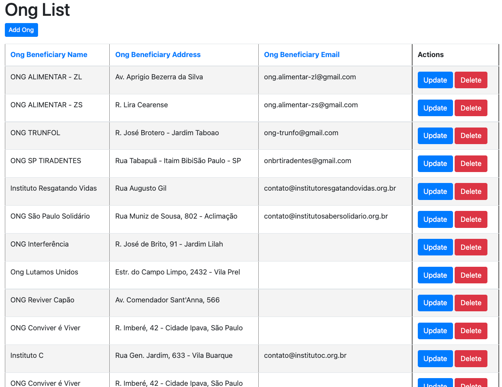
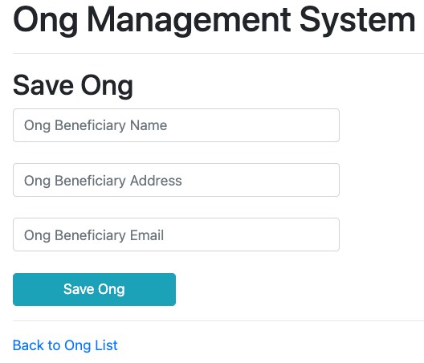
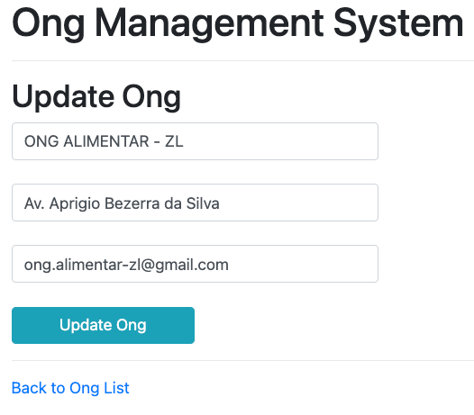

## FIAP | GLOBAL IMPACT | 2TDST | 2021
#### SQUAD: SLASHICORP
#### STUDENTS:

- [RM85619 - Allan Phyllyp Reis](https://www.linkedin.com/in/allan-reis-997b82171/)
- [RM84082 - Dihogo Cassimiro Teixeira](https://www.linkedin.com/in/dihogoteixeira/)
- [RM85833 - Fernando Borgatto Bouman](https://www.linkedin.com/in/fernando-borgatto-bouman-821534b9/)
- [RM86486 - Paloma Rangel Rocha](https://www.linkedin.com/in/palomara/)
- [RM85468 - Juan Carlos Benvive Serrano]()

#### SUBJECTS:
- DIGITAL BUSINESS ENABLEMENT 
- DEVOPS TOOLS AND CLOUD COMPUTING

#### TECHNOLOGIES:
- Spring Boot
- JPA
- Hibernate
- [Java JDK (v8+)](https://www.oracle.com/technetwork/java/javase/downloads/index.html)
- [Maven (v3+)](https://maven.apache.org/download.cgi)
- MySQL
- Thymeleaf

#### APPLICATION PURPOSE:
<ul>
    The purpose of this application is to provide an API with Brazilian ONGs data by type of segment,
    providing the user with next versions, Brazilian ONGs data by region and contact information. 
    This API should provide serialized data from raw tables of registration information 
    for regulated Brazilian ONGs so that you can work with their data.
</ul>

#### REQUIREMENTS INSTALLATION PER DISTRO
- [Install Docker Engine on CentOS](https://docs.docker.com/engine/install/centos/)
- [Install Docker Engine on Debian](https://docs.docker.com/engine/install/debian/)
- [Install Docker Engine on Fedora](https://docs.docker.com/engine/install/fedora/)
- [Install Docker Engine on Ubuntu](https://docs.docker.com/engine/install/ubuntu/)
- [Install Docker Desktop on Mac](https://docs.docker.com/desktop/mac/install/)
- [Install Docker Desktop on Windows](https://docs.docker.com/desktop/windows/install/)

#### RUNNING ON LOCAL ENV DOCKER
```bash
git clone https://github.com/2TDST/2tdst-gi-digital-and-devops.git && \
cd 2tdst-gi-digital-and-devops && \
docker-compose up -d
```

#### CHECK ENV APPLICATION
```bash
$ docker ps
CONTAINER ID   IMAGE                            COMMAND                  CREATED         STATUS         PORTS                                                  NAMES
ffd96ae4345d   springboot-dbe-ods_ods-backend   "java -jar /app.jar"     7 seconds ago   Up 6 seconds   0.0.0.0:8080->8080/tcp, :::8080->8080/tcp              springboot-dbe-ods_ods-backend_1
d85dec1876d8   mysql:5.7                        "docker-entrypoint.s…"   7 seconds ago   Up 6 seconds   0.0.0.0:3306->3306/tcp, :::3306->3306/tcp, 33060/tcp   springboot-dbe-ods_mysqldb_1
```

### LOCALHOST UI VALIDATION

Click [here](http://localhost:8080/) to check UI `Thymeleaf` on application.

`Ong List Page`



`Add New Ong Page`



`Update Ong Page`




